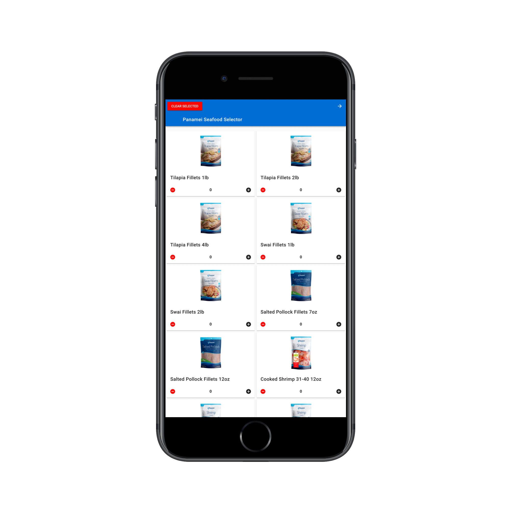

# [Panamei Seafood Selector](https://nperez0111.github.io/panamei/)

> Helps Panamei Employees make orders in a consistent format

## What it is

Simple Web App that can be installed to the homescreen of a phone to allow the Panamei Employee to make a few taps to enter an order of the different seafood products which Panamei carries via a few amount of taps to change the amount of cases to send.

## How it looks



## How it works

Is a simple Vue + Nuxt.js web app built with Vuetify.js that manipulates a list of titles and images to then output a list of selected items and their respective quantities.

## Build Setup

``` bash
# install dependencies
$ npm install # Or yarn install

# serve with hot reload at localhost:3000
$ npm run dev

# build for production and launch server
$ npm run build
$ npm start

# generate static project
$ npm run generate
```

For detailed explanation on how things work, check out the [Nuxt.js](https://github.com/nuxt/nuxt.js) and [Vuetify.js](https://vuetifyjs.com/) documentation.
